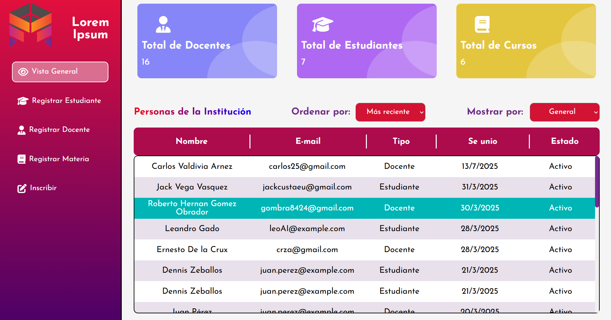
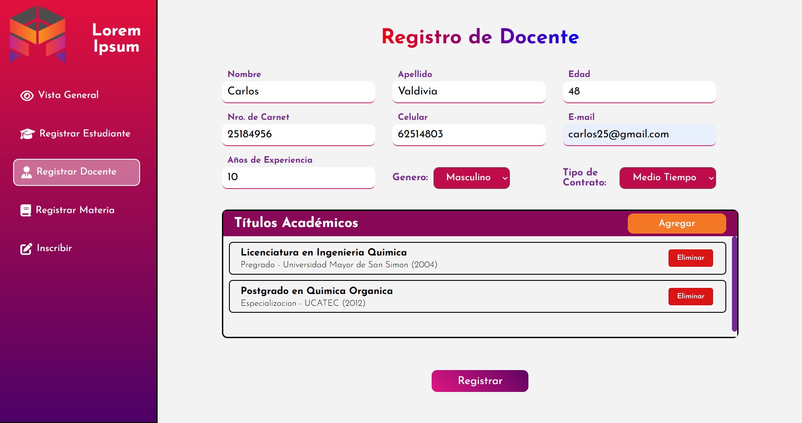
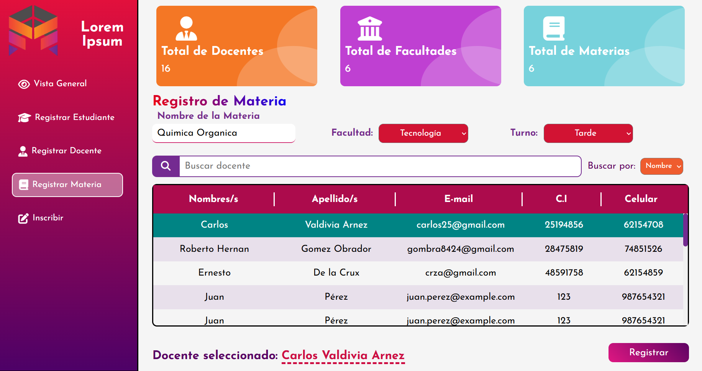
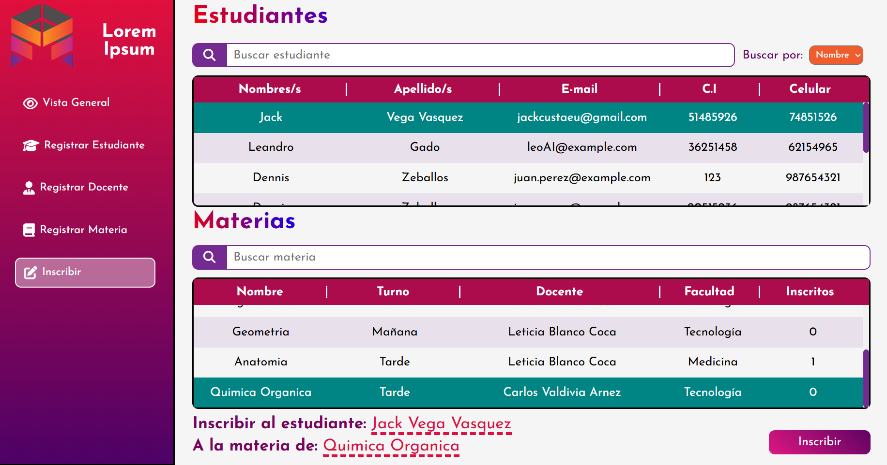

# 🎓 Preuniversitario Web

## 🧾 Descripción

Esta es una aplicación web tipo **SPA (Single Page Application)** diseñada para la **gestión administrativa de un instituto preuniversitario**. Su propósito es facilitar el trabajo del administrador, permitiéndole:

- Registrar estudiantes, docentes y materias.
- Inscribir estudiantes en materias específicas.
- Consultar en tiempo real todos los registros del sistema.
- Visualizar de forma clara la información consolidada, como la cantidad total de estudiantes, docentes y materias registradas, así como el número de inscritos por materia.

Toda esta información se presenta en tarjetas informativas dentro de la interfaz.

---

## 🚀 Tecnologías utilizadas

- **Frontend:** HTML, CSS, JavaScript Vanilla
- **Backend:** Node.js + Express
- **Base de datos:** Supabase (PostgreSQL como servicio)
- **Despliegue:** Render

---

## 🌐 Demo en línea

👉 [Ver aplicación desplegada](https://preuniversitario.onrender.com/)

> *Nota: puede demorar unos segundos en despertar si el servidor está inactivo (Render free).*

---

## 🖼️ Capturas de pantalla

### 🏠 Página de inicio de sesión

### 🏠 Página de inicio

### 📝 Registro de docente

### 📝 Registro de materia

### 📊 Vista de Inscripcion

---

